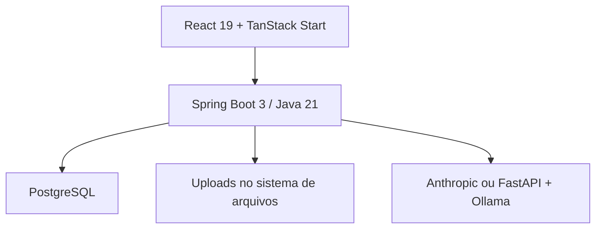

# ScoutPlay

Plataforma acadêmica de descoberta e acompanhamento de jovens atletas de futebol. O ScoutPlay reúne perfis, publicações, vídeos e ferramentas de avaliação para aproximar atletas e olheiros em um único ambiente.

> Este README descreve a entrega **ScoutPlay 2.0**. A branch `historico` preserva essa entrega e organiza, sem misturar código obsoleto, as decisões úteis das branches anteriores.

## Estado do projeto

O repositório é um protótipo acadêmico em evolução. A experiência principal está implementada, mas ainda existem pendências de segurança, persistência, desempenho e automação antes de uma publicação na internet. O backlog técnico e funcional está em [`docs/historico/ROADMAP.md`](docs/historico/ROADMAP.md).

### O que está implementado

| Área | Entrega atual |
| --- | --- |
| Identidade | Cadastro de atleta ou olheiro, login JWT em cookie HttpOnly, logout e recuperação de acesso |
| Perfis | Dados pessoais e esportivos, foto, seguidores e consulta de perfil público |
| Descoberta | Busca de atletas por nome, posição e pé dominante; shortlist de olheiros |
| Feed | Publicações com mídia, curtidas, comentários e respostas |
| Avaliação | Nota e comentário de um usuário sobre um atleta |
| IA | Copiloto que combina dados cadastrados com Anthropic ou serviço local FastAPI/Ollama |

Funcionalidades planejadas na primeira versão — como convites formais, contato intermediado por responsável, moderação e trilha de auditoria — ainda não fazem parte da entrega. A comparação entre visão original e implementação está em [`docs/historico/PLANEJAMENTO_FUNCIONAL.md`](docs/historico/PLANEJAMENTO_FUNCIONAL.md).

## Arquitetura



| Camada | Tecnologias e responsabilidade |
| --- | --- |
| Front-end | React 19, Vite, TanStack Start/Router e Tailwind CSS; interface em `http://localhost:3000` |
| API | Java 21, Spring Boot 3.3.4, Spring Web, Security e Data JPA; API em `http://localhost:8080` |
| Dados | PostgreSQL; entidades relacionais e detalhes de perfil armazenados em JSONB |
| Arquivos | Avatares em `uploads/avatars` e mídias do feed em `uploads/media` |
| IA | Anthropic quando `ANTHROPIC_API_KEY` estiver definida; caso contrário, FastAPI/Ollama em `http://localhost:8081` |

## Estrutura do repositório

```text
ScoutPlay/
├── back-end/                 # API Spring Boot, testes e serviço local de IA
│   └── src/main/resources/ia
├── front-end/                # aplicação React/TanStack
├── docs/                     # requisitos, banco, testes, integração e histórico
└── slides/                   # apresentação da entrega acadêmica
```

## Executando localmente

### Pré-requisitos

- Git;
- JDK 21;
- PostgreSQL 12 ou superior;
- Node.js 20 ou superior e npm;
- opcionalmente Python 3.10, FastAPI e Ollama para o modo local da IA.

### 1. Clonar a linha consolidada

```bash
git clone --branch historico https://github.com/vhdtv/ScoutPlay.git
cd ScoutPlay
```

Para reproduzir exatamente a branch entregue à faculdade, troque `historico` por `ScoutPlay2.0`.

### 2. Preparar o PostgreSQL

Crie um banco local sem versionar credenciais no repositório:

```sql
CREATE DATABASE scoutplaydb;
```

Defina as variáveis exigidas pelo back-end. O segredo JWT deve ter pelo menos 32 caracteres.

```bash
export DB_URL='jdbc:postgresql://localhost:5432/scoutplaydb'
export DB_USERNAME='postgres'
export DB_PASSWORD='troque-por-uma-credencial-local'
export JWT_SECRET='troque-por-um-segredo-local-longo-e-aleatorio'
```

Variáveis opcionais:

| Variável | Finalidade | Padrão local |
| --- | --- | --- |
| `JWT_EXPIRATION` | validade do token em milissegundos | `86400000` |
| `COOKIE_SECURE` | exige HTTPS para o cookie | `false` |
| `ANTHROPIC_API_KEY` | habilita o provedor externo de IA | vazio |
| `IA_URL` | endereço do serviço Python local | `http://localhost:8081` |

O envio de e-mail requer também as propriedades `spring.mail.*` no ambiente local.

### 3. Iniciar a API

```bash
cd back-end
sh ./mvnw spring-boot:run
```

A API fica disponível em `http://localhost:8080`. O Swagger UI, quando habilitado, fica em `http://localhost:8080/swagger-ui/index.html`.

### 4. Iniciar o front-end

Em outro terminal:

```bash
cd front-end
npm install
npm run dev
```

Abra `http://localhost:3000`.

### 5. IA local opcional

Sem `ANTHROPIC_API_KEY`, inicie o serviço local antes de usar o copiloto:

```bash
cd back-end/src/main/resources/ia
python -m pip install fastapi uvicorn ollama numpy
ollama pull phi3:mini
ollama pull embeddinggemma:latest
python -m uvicorn api:app --host 0.0.0.0 --port 8081
```

Consulte [`docs/ia-integracao.md`](docs/ia-integracao.md) para detalhes e limitações do módulo.

## API principal

Todas as respostas da aplicação usam o envelope `ApiResponse`.

| Método e rota | Finalidade | Autenticação esperada |
| --- | --- | --- |
| `POST /api/signup` | criar conta de atleta ou olheiro | pública |
| `POST /api/login` | autenticar e gravar cookie JWT | pública |
| `POST /api/logout` | encerrar sessão | pública |
| `POST /api/forgot-password` | iniciar recuperação de acesso | pública |
| `GET /api/user?user=...` | consultar perfil | opcional |
| `PATCH /api/user/info` | atualizar perfil próprio | cookie JWT |
| `POST /api/user/avatar` | atualizar avatar | cookie JWT |
| `GET /api/atletas` | buscar atletas | pública |
| `GET /api/shortlist` | listar seleção do usuário | cookie JWT |
| `POST /api/user/{username}/avaliar` | avaliar atleta | cookie JWT |
| `GET /api/post/` | listar feed paginado | pública |
| `POST /api/post/` | criar publicação | cookie JWT esperado pelo serviço |
| `GET /api/media/{filename}` | servir mídia do feed | pública |
| `GET /api/avatar/{filename}` | servir avatar | pública |
| `POST /api/ia/prompt` | consultar o copiloto | matriz de acesso em revisão |

Uma coleção Postman está disponível em [`docs/ScoutPlay.postman_collection.json`](docs/ScoutPlay.postman_collection.json).

## Testes e qualidade

### Back-end

```bash
cd back-end
sh ./mvnw test
```

O projeto contém testes unitários de serviço e cenários BDD/Cucumber. Para validar a aplicação completa, execute-os com JDK 21 e acesso às dependências Maven.

### Front-end

```bash
cd front-end
npm run build
npm run lint
npm test
```

Na auditoria da branch `ScoutPlay2.0`, o build de produção foi concluído. O lint encontrou pendências e ainda não existem testes front-end detectáveis pelo Vitest; esses itens permanecem no roadmap.

## Documentação

- [Requisitos funcionais](docs/requisitos/requisitos-funcionais.md)
- [Requisitos não funcionais](docs/requisitos/requisitos-nao-funcionais.md)
- [Modelagem do banco](docs/modelagem-banco.md)
- [Integração da IA](docs/ia-integracao.md)
- [Plano e roteiros de teste](docs/testes/plano-de-teste.md)
- [Cronograma acadêmico](docs/cronograma-projeto.md)
- [Índice histórico das branches](docs/historico/README.md)
- [Roadmap consolidado](docs/historico/ROADMAP.md)

## Histórico das branches

| Branch | Papel no repositório |
| --- | --- |
| `ScoutPlay2.0` | entrega acadêmica de referência e base desta consolidação |
| `historico` | documentação consolidada, sem alterar o código entregue |
| `main` | primeira geração do produto e artefatos acadêmicos antigos |
| `frontpv` | protótipo front-end já absorvido pela entrega 2.0 |
| `Maria-Clara-Br` e `video` | experimentos antigos de interface/mídia |
| `feat/db-remodel` | experimento posterior de IA; exige revisão antes de integração |

O inventário com decisões de preservação está em [`docs/historico/README.md`](docs/historico/README.md).

## Equipe acadêmica

| Integrante | Contribuição registrada na entrega |
| --- | --- |
| Victor Henrique Dias | Scrum Master, back-end e integração de IA |
| Paulo Vitor Amorim de Oliveira | back-end, JWT e DevOps |
| Maria Clara Marques Lino | front-end React e testes de usabilidade |
| Lucas Ferreira Andrade | back-end, BDD/Cucumber e repositórios |
| Cesar Augusto Ferreira Martins | front-end, componentes e design |
| Caio Alves Fernandes | controllers e documentação |

Dados acadêmicos pessoais foram removidos deste README; o histórico do Git já preserva a autoria técnica.

## Licença

O repositório não contém, nesta entrega, um arquivo de licença. Antes de reutilizar ou distribuir o código fora do contexto acadêmico, os autores devem escolher e adicionar uma licença explícita.
